# Лабораторная работа №1 — C#

**Автор:** Чичарин Денис, ИТ-2  
**Дисциплина:** Программирование на C#  
**Ссылка на GitHub:** [https://github.com/0RockManson0/Lab-1-1.git](https://github.com/0RockManson0/Lab-1-1.git)

**Файлы проекта:**
- `main.cs` — точка входа (запуск через `main.cs`)
- `TaskSolver.cs` — реализация методов

**Запуск:** через `main.cs`

---

## Как запустить

1. Установите .NET SDK.
2. Клонируйте репозиторий:

```
git clone https://github.com/0RockManson0/Lab-1-1.git
cd Lab-1-1
```

3. Запустите проект:

```
dotnet run
```

4. Выберите номер задачи (1–20) или `0` для выхода.

---

# Задание 1

## Задача 1

### Текст задачи

Дана сигнатура метода: `public double fraction(double x);`

Необходимо реализовать метод таким образом, чтобы он возвращал только дробную часть числа x. Подсказка: вещественное число может быть преобразовано к целому путем отбрасывания дробной части.

**Пример:**

x = 5,25  
результат: 0,25

### Алгоритм решения

1. Ввод вещественного числа x с клавиатуры с проверкой корректности формата (использовал `double.TryParse`).
2. Преобразование введенного числа x к целому типу путем явного приведения `(int)x`. При этом дробная часть автоматически отбрасывается.
3. Вычитание полученной целой части из исходного вещественного числа: `x - (int)x`.
4. Вывод полученного результата на экран.

### Тестирование

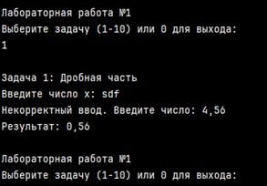

---

## Задача 2

### Текст задачи

Дана сигнатура метода: `public int charToNum(char x);`

Метод принимает символ x, который представляет собой один из "0 1 2 3 4 5 6 7 8 9". Необходимо реализовать метод таким образом, чтобы он преобразовывал символ в соответствующее число. Подсказка: код символа '0' — это число 48.

**Пример:**

x = '3'  
результат: 3

### Алгоритм решения

1. Получить символ x от пользователя (проверить, что это цифра от 0 до 9).
2. Вычесть из кода символа x код символа 0 (48): `x - '0'`.
3. Так как символы цифр в ASCII идут подряд, разность даст числовое значение.
4. Вернуть результат.

### Тестирование

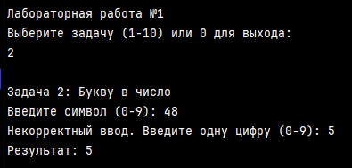

---

## Задача 3

### Текст задачи

Дана сигнатура метода: `public bool is2Digits(int x);`

Необходимо реализовать метод таким образом, чтобы он принимал число x и возвращал true, если оно двузначное.

**Пример 1:** x = 32 → true  
**Пример 2:** x = 516 → false

### Алгоритм решения

1. Получить целое число x от пользователя.
2. Если число отрицательное, взять его по модулю (умножить на -1).
3. Проверить, лежит ли число в диапазоне от 10 до 99 включительно.
4. Вернуть true, если да, иначе false.

### Тестирование

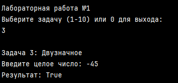
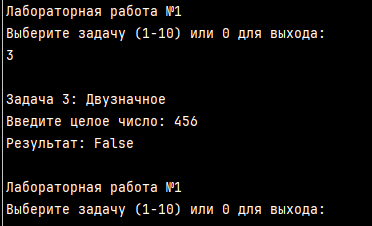

---

## Задача 4

### Текст задачи

Дана сигнатура метода: `public bool isInRange(int a, int b, int num);`

Метод принимает левую и правую границу (a и b) некоторого числового диапазона. Необходимо реализовать метод таким образом, чтобы он возвращал true, если num входит в указанный диапазон (включая границы). Обратите внимание, что отношение a и b заранее неизвестно.

**Пример 1:** a = 5, b = 1, num = 3 → true  
**Пример 2:** a = 2, b = 15, num = 33 → false

### Алгоритм решения

1. Получить три целых числа a, b, num.
2. Определить минимум и максимум из a и b: если a > b, то min = b, max = a.
3. Проверить условие `num >= min && num <= max`.
4. Вернуть результат.

### Тестирование

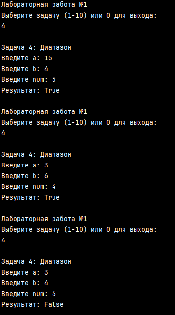

---

## Задача 5

### Текст задачи

Дана сигнатура метода: `public bool isEqual(int a, int b, int c);`

Необходимо реализовать метод таким образом, чтобы он возвращал true, если все три полученных методом числа равны.

**Пример 1:** a = 3, b = 3, c = 3 → true  
**Пример 2:** a = 2, b = 15, c = 2 → false

### Алгоритм решения

1. Получить три целых числа a, b, c.
2. Проверить равенство: `a == b && b == c`.
3. Вернуть результат.

### Тестирование

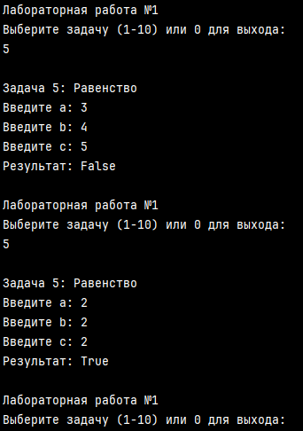

---

# Задание 2

## Задача 6

### Текст задачи

Дана сигнатура метода: `public int abs(int x);`

Необходимо реализовать метод таким образом, чтобы он возвращал модуль числа x (если оно было положительным, то таким и остается, если оно было отрицательным – то необходимо вернуть его без знака минус).

### Алгоритм решения

1. Получить целое число x от пользователя.
2. Проверить, является ли число отрицательным (`x < 0`).
3. Если да, вернуть `-x` (инвертировать знак).
4. Если нет, вернуть x как есть.

### Тестирование

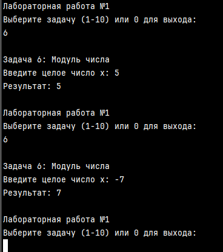

---

## Задача 7

### Текст задачи

Дана сигнатура метода: `public bool is35(int x);`

Необходимо реализовать метод таким образом, чтобы он возвращал true, если число x делится нацело на 3 или 5. При этом, если оно делится и на 3, и на 5, то вернуть надо false. Подсказка: оператор `%` позволяет получить остаток от деления.

**Пример 1:** x = 5 → true  
**Пример 2:** x = 8 → false  
**Пример 3:** x = 15 → false

### Алгоритм решения

1. Получить целое число x от пользователя.
2. Проверить делимость на 3: `x % 3 == 0`.
3. Проверить делимость на 5: `x % 5 == 0`.
4. Вернуть true, если число делится на 3 ИЛИ на 5, но НЕ на оба одновременно: `(divBy3 || divBy5) && !(divBy3 && divBy5)`.

### Тестирование

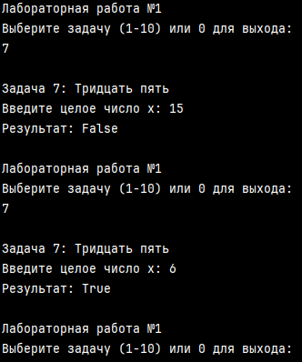

---

## Задача 8

### Текст задачи

Дана сигнатура метода: `public int max3(int x, int y, int z);`

Необходимо реализовать метод таким образом, чтобы он возвращал максимальное из трех полученных методом чисел. Подсказка: идеальное решение включает всего две инструкции `if` и не содержит вложенных `if`.

**Пример 1:** x = 5, y = 7, z = 7 → 7  
**Пример 2:** x = 8, y = -1, z = 4 → 8

### Алгоритм решения

1. Получить три целых числа x, y, z.
2. Инициализировать переменную max значением x.
3. Если y > max, обновить max = y.
4. Если z > max, обновить max = z.
5. Вернуть max.

### Тестирование

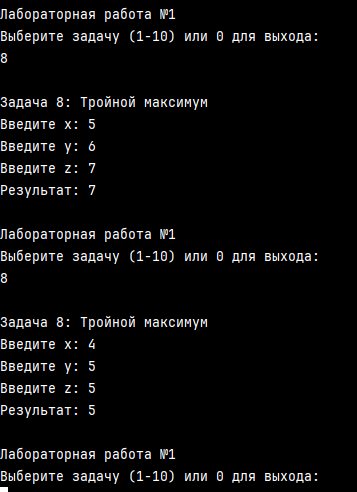

---

## Задача 9

### Текст задачи

Дана сигнатура метода: `public int sum2(int x, int y);`

Необходимо реализовать метод таким образом, чтобы он возвращал сумму чисел x и y. Однако, если сумма попадает в диапазон от 10 до 19, то надо вернуть число 20.

**Пример 1:** x = 5, y = 7 → 20  
**Пример 2:** x = 8, y = -1 → 7

### Алгоритм решения

1. Получить два целых числа x и y.
2. Вычислить сумму: `sum = x + y`.
3. Проверить, попадает ли сумма в диапазон от 10 до 19 включительно.
4. Если да, вернуть 20. Иначе вернуть sum.

### Тестирование

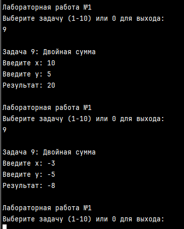

---

## Задача 10

### Текст задачи

Дана сигнатура метода: `public String day(int x);`

Метод принимает число x, обозначающее день недели. Необходимо реализовать метод таким образом, чтобы он возвращал строку, которая будет обозначать текущий день недели, где 1 — это понедельник, а 7 — воскресенье. Если число не от 1 до 7, то верните текст "это не день недели". Вместо `if` в данной задаче используйте `switch`.

**Пример:** x = 5 → "пятница"

### Алгоритм решения

1. Получить целое число x от пользователя.
2. Использовать оператор `switch` для сопоставления числа с названием дня недели:
   - 1 → "понедельник"
   - 2 → "вторник"
   - 3 → "среда"
   - 4 → "четверг"
   - 5 → "пятница"
   - 6 → "суббота"
   - 7 → "воскресенье"
3. В ветке `default` вернуть строку "это не день недели".

### Тестирование

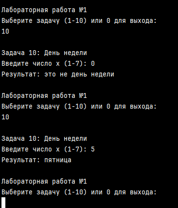

---

## Задача 11

### Текст задачи

Дана сигнатура метода: `public String listNums(int x);`

Необходимо реализовать метод таким образом, чтобы он возвращал строку, в которой будут записаны все числа от 0 до x (включительно).

**Пример:** x = 5 → "0 1 2 3 4 5"

### Алгоритм решения

1. Инициализировать пустую строку result.
2. Запустить цикл `for` от 0 до x включительно.
3. На каждой итерации добавлять текущее число i к строке result.
4. Если i не является последним числом, добавлять пробел для разделения.
5. Вернуть итоговую строку.

### Тестирование

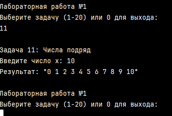

---

## Задача 12

### Текст задачи

Дана сигнатура метода: `public String chet(int x);`

Необходимо реализовать метод таким образом, чтобы он возвращал строку, в которой будут записаны все четные числа от 0 до x (включительно). Инструкцию `if` использовать не следует.

**Пример:** x = 9 → "0 2 4 6 8"

### Алгоритм решения

1. Инициализировать пустую строку result.
2. Запустить цикл `for`, начиная с 0, с шагом 2 (`i += 2`), пока `i <= x`. Это автоматически гарантирует выбор только четных чисел без использования `if`.
3. На каждой итерации добавлять число i и пробел к строке result.
4. После цикла применить метод `.Trim()` к строке, чтобы удалить лишний пробел в конце.
5. Вернуть итоговую строку.

### Тестирование

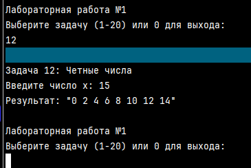

---

## Задача 13

### Текст задачи

Дана сигнатура метода: `public int numLen(long x);`

Необходимо реализовать метод таким образом, чтобы он возвращал количество знаков в числе x.

**Пример:** x = 12567 → 5

### Алгоритм решения

1. Если число равно 0, сразу вернуть 1.
2. Взять модуль числа (если `x < 0`, умножить на -1), чтобы корректно считать длину отрицательных чисел.
3. Инициализировать счетчик `count = 0`.
4. В цикле `while` делить число на 10 нацело, пока оно больше 0, увеличивая count на 1 на каждой итерации.
5. Вернуть значение count.

### Тестирование

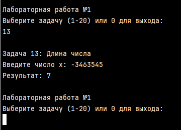

---

## Задача 14

### Текст задачи

Дана сигнатура метода: `public void square(int x);`

Необходимо реализовать метод таким образом, чтобы он выводил на экран квадрат из символов '*' размером x.

**Пример:** x = 4 → 4 строки по 4 символа '*'

### Алгоритм решения

1. Запустить внешний цикл `for` от 0 до `x-1` (для строк).
2. Внутри него инициализировать пустую строку row.
3. Запустить внутренний цикл `for` от 0 до `x-1` (для столбцов), добавляя символ '*' к строке row.
4. Вывести строку row на экран.

### Тестирование

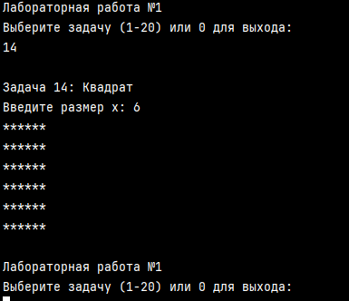

---

## Задача 15

### Текст задачи

Дана сигнатура метода: `public void rightTriangle(int x);`

Необходимо реализовать метод таким образом, чтобы он выводил на экран треугольник из символов '*' высотой x, выровненный по правому краю.

**Пример:** x = 4 → треугольник от 1 до 4 звезд, выровненный вправо.

### Алгоритм решения

1. Запустить цикл `for` от 1 до x (номер текущей строки `i`).
2. Сформировать строку пробелов: цикл от 0 до `x - i`, добавляя пробелы.
3. Сформировать строку звезд: цикл от 0 до `i - 1`, добавляя '*'.
4. Объединить строки и вывести результат.

### Тестирование

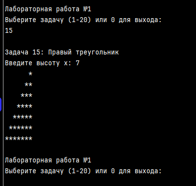

---

## Задача 16

### Текст задачи

Дана сигнатура метода: `public int findFirst(int[] arr, int x);`

Необходимо реализовать метод таким образом, чтобы он возвращал индекс первого вхождения числа x в массив arr. Если число не входит в массив – возвращается -1.

### Алгоритм решения

1. Запустить цикл `for` по всем индексам массива arr от 0 до `Length - 1`.
2. На каждой итерации проверять условие `arr[i] == x`.
3. Если условие истинно, немедленно вернуть текущий индекс i.
4. Если цикл завершился и совпадений не найдено, вернуть `-1`.

### Тестирование

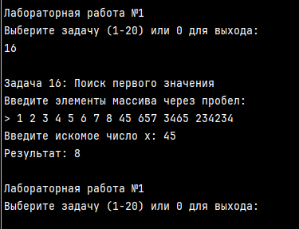
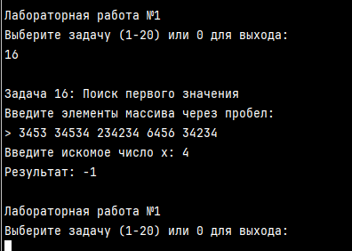

---

## Задача 17

### Текст задачи

Дана сигнатура метода: `public int maxAbs(int[] arr);`

Необходимо реализовать метод таким образом, чтобы он возвращал наибольшее по модулю значение массива arr.

### Алгоритм решения

1. Инициализировать переменные maxVal и maxAbsVal значением первого элемента массива (и его модулем).
2. Запустить цикл `for` от 1 до конца массива.
3. На каждой итерации вычислять модуль текущего элемента.
4. Если текущий модуль строго больше maxAbsVal, обновить maxAbsVal и запомнить исходное значение в maxVal.
5. После цикла вернуть maxVal.

### Тестирование

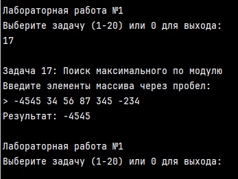

---

## Задача 18

### Текст задачи

Дана сигнатура метода: `public int[] add(int[] arr, int[] ins, int pos);`

Необходимо реализовать метод таким образом, чтобы он возвращал новый массив, содержащий все элементы arr, но в позицию pos вставлены значения массива ins.

### Алгоритм решения

1. Создать новый массив result длиной `arr.Length + ins.Length`.
2. Инициализировать индекс `index = 0`.
3. Циклом скопировать элементы из arr в result до позиции pos.
4. Циклом скопировать все элементы из массива ins в result.
5. Циклом скопировать оставшиеся элементы из arr (начиная с pos) в result.
6. Вернуть массив result.

### Тестирование

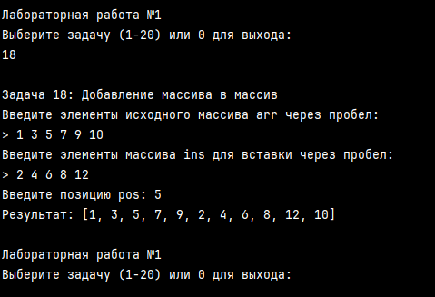

---

## Задача 19

### Текст задачи

Дана сигнатура метода: `public int[] reverseBack(int[] arr);`

Необходимо реализовать метод таким образом, чтобы он возвращал новый массив, в котором значения массива arr записаны задом наперед.

### Алгоритм решения

1. Создать новый массив result той же длины, что и arr.
2. Запустить цикл `for` от 0 до `Length - 1`.
3. На каждой итерации присваивать `result[i] = arr[arr.Length - 1 - i]`.
4. Вернуть массив result.

### Тестирование

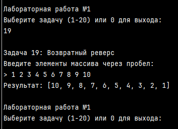

---

## Задача 20

### Текст задачи

Дана сигнатура метода: `public int[] findAll(int[] arr, int x);`

Необходимо реализовать метод таким образом, чтобы он возвращал новый массив, в котором записаны индексы всех вхождений числа x в массив arr.

### Алгоритм решения

1. Пройти по массиву первым циклом и подсчитать количество вхождений числа x (переменная count).
2. Создать новый массив result длиной count.
3. Пройти по исходному массиву вторым циклом. Если `arr[i] == x`, записать индекс i в result и увеличить счетчик позиций в result.
4. Вернуть массив result.

### Тестирование

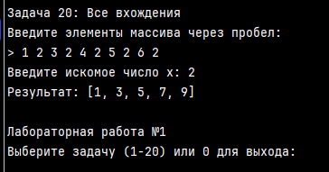

---

## Ссылка

GitHub: [https://github.com/0RockManson0/Lab-1-1.git](https://github.com/0RockManson0/Lab-1-1.git)  
Запуск через `main.cs`
